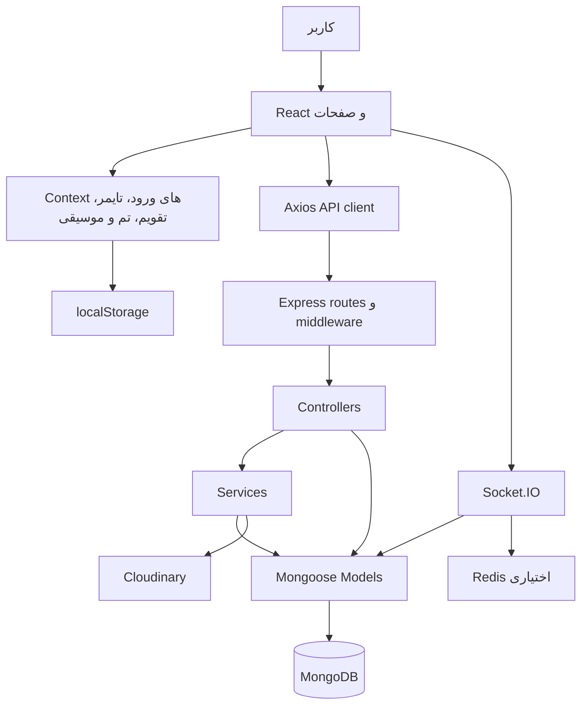

# گزارش ارزیابی مهندسی و محصول Codelume / DevTracker

ارزیابی پایه: ۲ اکتبر ۲۰۲۶ — نسخهٔ محلی در commit `d8545ee`
پیگیری و اجرای اصلاحات: ۴ اکتبر ۲۰۲۶

یافته‌های پایین در ابتدا روی نسخهٔ پایه ثبت شدند. کد از آن زمان تغییر کرده است؛ برای وضعیت فعلی، جدول «وضعیت اجرای پیشنهادها» در انتهای گزارش را ملاک بگیرید. نتایج بازتولید و وابستگی‌ها شواهد همان نسخهٔ پایه‌اند، نه اسکن تازهٔ وضعیت فعلی.

## نتیجهٔ اصلی

این پروژه یک اپلیکیشن وب برای ثبت زمان یادگیری و کار برنامه‌نویسی، مشاهدهٔ پیشرفت و ایجاد انگیزه است. نام محصول در رابط کاربری Codelume است و نام DevTracker در بک‌اند، بسته‌ها و کلیدهای ذخیره‌سازی باقی مانده است. پروژه از نظر تعداد امکانات فراتر از یک نمونهٔ ساده است، اما چند نقص امنیتی و چند مشکل در مسیر اصلی ثبت زمان دارد که پیش از عرضهٔ عمومی باید اصلاح شوند.

پیشنهاد من حفظ React، Express و MongoDB و اصلاح تدریجی پروژه است. بازنویسی کامل یا تبدیل آن به میکروسرویس در وضعیت فعلی هزینهٔ اضافی ایجاد می‌کند. مسئلهٔ اصلی قراردادهای ناسازگار میان بخش‌ها، مهاجرت ناقص داده، منطق دسترسی و نبود آزمون برای رفتارهای مهم است.

## دامنه و محدودیت بررسی

- در نسخهٔ پایه، فهرست پروژه شامل ۸۲ فایل زیر `frontend/src` و `backend/src` و حدود ۱۷٬۲۸۹ خط بود؛ این عدد شامل اسکریپت‌های مهاجرت و CSS نیز می‌شود.
- مسیرها، مدل‌ها، سرویس‌ها، احراز هویت، تایمر، صفحات کاربر و مدیر، کامپوننت‌های مشترک، تنظیمات استقرار و اسکریپت‌های داده بررسی شدند. بخش‌های حساس با خواندن مستقیم و دنبال کردن فراخوانی‌ها بررسی شده‌اند.
- build فرانت‌اند و lint اجرا شدند. ۳۱ فایل JavaScript/MJS در بک‌اند، API و اسکریپت فرانت‌اند از نظر syntax بررسی شدند.
- ۱۵ بررسی بازتولید با fakeهای درون حافظه انجام شدند. بخشی اجرای واقعی توابع با مدل‌های جایگزین و بخشی بررسی قراردادهای سورس هستند. همهٔ ۱۵ مورد رفتار گزارش‌شده را تأیید کردند؛ این به معنی سالم بودن پروژه نیست.
- هیچ اتصال به دیتابیس واقعی برقرار نشد و هیچ ورود، حذف کاربر، مهاجرت یا تغییر دادهٔ واقعی انجام ندادم. در نسخهٔ پایه سرور اصلی را نیز اجرا نکردم؛ در پیگیری هم همچنان فقط کد محلی و آزمون‌های بدون دیتابیس واقعی بررسی شدند.
- مرورگر تعاملی و آزمون تصویری روی دسکتاپ/موبایل انجام نشد. ارزیابی ظاهر، دسترس‌پذیری و جریان کار از JSX، CSS و منطق صفحات است. عملکرد واقعی روی دستگاه ضعیف، نرخ ریزش کاربران و زمان پاسخ production اندازه‌گیری نشده‌اند.
- اسکن `npm audit --json` در گزارش پایه انجام شد. اسکن تازه در پیگیری به‌دلیل خطای دسترسی به npm registry کامل نشد؛ جدول قدیمی وضعیت امنیت نسخه‌های فعلی را تأیید نمی‌کند.
- گزارش پایه هنگام نوشته‌شدن هیچ کد اجرایی را تغییر نداده بود. در پیگیری، فایل‌های پروژه اصلاح شدند؛ فهرست و اعتبارسنجی آن‌ها در انتهای گزارش است.

شواهد قابل اجرا: [اسکریپت بازتولید](audit/reproduce-findings.mjs)، [نتایج ۱۵ بررسی](audit/reproduction-results.json).

## پروژه چه کاری می‌کند؟

کاربر ثبت‌نام می‌کند، موضوع یادگیری یا پروژه می‌سازد و با تایمر شمارش معکوس، کرنومتر یا ثبت دستی، زمان خود را ذخیره می‌کند. هر جلسه به آمار، ساعت تجمعی، استریک و امتیاز XP وصل می‌شود. سپس کاربر در داشبورد، نمودارها و تقویم فعالیت، روند خود را می‌بیند. نشان‌ها و چالش‌ها انگیزه می‌دهند؛ موسیقی و گربهٔ همراه فضای تمرکز ایجاد می‌کنند. بخش اجتماعی، دنبال کردن کاربران، لیگ هفتگی و پیام خصوصی را اضافه می‌کند. مدیر نیز فهرست کاربران، آمار عمومی و جزئیات فعالیت را می‌بیند.

کاربر هدف محتمل، دانشجوی برنامه‌نویسی یا توسعه‌دهنده‌ای است که می‌خواهد عادت کار منظم بسازد. این برداشت از محصول است؛ در ریپو سندی برای مخاطب هدف، مدل کسب‌وکار یا اعتبارسنجی نیاز بازار وجود ندارد.

| بخش | وظیفهٔ فعلی | ارزیابی و جهت بهبود |
|---|---|---|
| ورود و ثبت‌نام | ایمیل/رمز، جلسهٔ ۳۰روزه، انتخاب آواتار | اصلاح امنیت؛ افزودن بازیابی رمز و تأیید ایمیل؛ onboarding با اولین جلسه |
| داشبورد | ساعات امروز/هفته/ماه/سال، هدف، استریک، XP، فعالیت اخیر | دکمهٔ شروع واضح و بازخورد عملی؛ کاهش تأکید هم‌زمان بر تعداد زیادی عدد |
| تایمر | countdown، stopwatch، پیش‌تنظیم‌ها، ثبت دستی، صدای محیط | اولویت نخست صحت ثبت؛ جداسازی مطالعه و استراحت؛ مدیریت شکست ذخیره |
| تکنولوژی‌ها | پوشه، رنگ، آیکن سفارشی، ساعت تجمعی | شناسهٔ معنایی ثابت، آرشیو، ترتیب همگام‌شونده، ارتباط با پروژه |
| پروژه‌ها | عنوان/توضیح، ساعت، شروع تایمر | هدف خروجی، وظیفه/مرحله، وضعیت، جلسهٔ اخیر؛ پرهیز از گسترش به مدیریت پروژهٔ سنگین |
| تاریخچه | فیلتر و جست‌وجو، مرتب‌سازی و حذف | اصلاح فیلتر پروژه؛ صفحه‌بندی؛ ویرایش جلسه؛ undo حذف |
| آمار | نمودار زمان و توزیع تکنولوژی | تعریف شفاف شاخص‌ها، پشتیبانی درست تقویم، صفرهای دوره‌های بدون فعالیت |
| تقویم | heatmap سالانه و جلسات هر روز | استفاده از aggregate بک‌اند، تعامل صفحه‌کلید و خلاصهٔ ماهانه |
| نشان‌ها | milestone زمان و استریک | اصلاح نام‌های ناسازگار؛ پاداش کوچک در مراحل آغازین؛ پیشرفت تا نشان بعدی |
| چالش‌ها | چالش پیش‌فرض و سفارشی روز/ساعت | تمایز milestone مادام‌العمر از چالش از تاریخ شروع تا پایان |
| یادداشت‌ها | نوشته و امتیاز بهره‌وری هر روز | draft خودکار، اتصال به جلسه و جست‌وجو؛ جلوگیری از از دست رفتن متن |
| موسیقی و همراه | چهار قطعه، پلیر شناور، گربهٔ متحرک | اختیاری و کم‌حجم؛ حالت تمرکز آرام؛ ذخیرهٔ ترجیح مخفی‌سازی |
| جامعه و پیام‌ها | کشف افراد، follow، لیگ و چت | اصلاح حریم خصوصی و realtime؛ opt-in رقابت؛ block/report و pagination پیام‌ها |
| تنظیمات | پروفایل، هدف، تقویم، اعلان، backup | واقعی کردن اعلان‌ها، بازیابی صحیح، یکپارچه‌سازی ذخیرهٔ تنظیمات |
| پنل مدیر | گزارش‌ها، جزئیات و نقش/حذف کاربر | احراز هویت قابل اتکا، حذف حساب کامل، حداقل نمایش دادهٔ خصوصی و audit log |
| درباره | معرفی توسعه‌دهنده و تماس | مناسب به‌عنوان صفحهٔ فرعی؛ صفحهٔ عمومی معرفی محصول و راهنما نیز مفید است |

## معماری و شیوهٔ کدنویسی

پروژه یک اپلیکیشن دو بخشی با بک‌اند یکپارچه است، نه میکروسرویس. فرانت‌اند SPA با React 19، Vite، React Router، Tailwind و Chart.js ساخته شده؛ بک‌اند Node.js با Express و Mongoose است. دادهٔ جاری در MongoDB نگهداری می‌شود. فایل backup و اسکریپت‌های MySQL نشان می‌دهند پروژه از مدل قبلی مبتنی بر MySQL مهاجرت کرده است. Cloudinary برای آواتار، Socket.IO برای رویداد زنده و Redis به‌صورت اختیاری برای انتشار رویداد میان نمونه‌ها وجود دارد.

جریان ثبت جلسه در `SessionService.createSession` این است: بررسی مالکیت پروژه/تکنولوژی، ساخت جلسه، افزایش ساعت موجودیت‌ها، محاسبهٔ استریک، افزودن XP، بررسی نشان‌ها و به‌روزرسانی چالش‌ها. همین مسیر قلب اپ است و باید بیشترین پوشش آزمون و تضمین سازگاری را داشته باشد.

تقسیم `routes/controllers/services/models` نقطهٔ شروع مناسبی است؛ بااین‌حال سرویس‌ها و کنترلرهای عمومی در فایل‌های تجمیعی بزرگ شده‌اند و بخش اجتماعی مستقیم از controller به model می‌رود. مدل‌ها علاوه بر دسترسی داده، منطق کسب‌وکار و مهاجرت دارند. در فرانت‌اند نیز صفحه‌هایی مثل Community تعداد زیادی مسئولیت دارند: دریافت داده، socket، follow، pagination، profile modal و پیام. کد عمدتاً JavaScript بدون قرارداد نوع مشترک است و چند باگ فعلی دقیقاً از همین ناهماهنگی قراردادها ایجاد شده‌اند.

نقاط قوت قابل حفظ: lazy loading صفحات، جدا کردن UI مشترک، مدیریت error بک‌اند، استفاده از `scrypt` و salt برای رمز، هش کردن توکن ذخیره‌شده، فیلتر مالکیت در بیشتر عملیات شخصی، ایندکس یکتای بعضی ارتباط‌ها، محاسبهٔ تایمر با deadline/timestamp به‌جای شمردن tick، واکنش به بازگشت تب و بارگذاری موسیقی فقط هنگام نیاز.

## یافته‌های فوری امنیتی — P0

### S01. ایمیل قابل تغییر، دسترسی مدیر ایجاد می‌کند

شواهد: `backend/src/middlewares/auth.js:31`، `backend/src/middlewares/validation.js:137`، `backend/src/models/UserModel.js:180`.

`requireAdmin` علاوه بر `role`، یک ایمیل ثابت را مدیر تشخیص می‌دهد. همان ایمیل از API تنظیمات قابل تغییر است و در schema قید یکتایی ایمیل وجود ندارد. بنابراین این فقط پنهان/نمایان کردن لینک پنل نیست؛ مجوز واقعی endpointهای مدیر قابل عبور است. رفتار پذیرش کاربر با نقش عادی و ایمیل ویژه در بازتولید تأیید شد.

اصلاح: حذف تمام استثناهای ایمیل در بک‌اند و فرانت‌اند؛ مجوز فقط از نقش قابل مدیریت سمت سرور؛ ایمیل نرمال‌شده و unique با مدیریت رکوردهای تکراری پیش از ایجاد ایندکس؛ جریان جداگانهٔ تغییر ایمیل همراه با تأیید مالکیت. آزمون مهم: کاربر عادی با هر ایمیلی به endpoint مدیر پاسخ ۴۰۳ بگیرد.

### S02. اطلاعات اتصال دیتابیس و رمز مدیر داخل سورس هستند

شواهد: `backend/src/config/database.js:16`، `backend/src/scripts/importJsonToMongo.js:13`، `backend/src/models/UserModel.js:204`، `backend/src/services/AuthService.js:63`.

URI اتصال حاوی credential به‌عنوان مقدار جایگزین وجود دارد. حساب مدیر نیز رمز ثابت دارد که هنگام ورود ویژه و مهاجرت آواتار دوباره هش و تنظیم می‌شود؛ حتی رمز در یک log چاپ می‌شود. صحت یا فعال بودن این credentialها روی سرویس واقعی بررسی نشده، اما وجودشان در سورس قطعی است.

اصلاح: تغییر credentialهای موجود، حذف secret از کد و log و بررسی تاریخچهٔ Git؛ تنظیمات فقط از environment و خطای واضح هنگام نبود مقدار. ایجاد مدیر باید ابزار مستقل و کنترل‌شدهٔ bootstrap باشد؛ ورود عادی نباید رمز یا مالکیت داده را تغییر دهد. اگر استقرار فعلی وجود دارد، نشست‌های مرتبط نیز پس از اصلاح بررسی و در صورت لزوم باطل شوند.

### S03. شناسهٔ ناموجود می‌تواند به حساب دیگری منتهی شود

شواهد: `backend/src/models/UserModel.js:99`، `backend/src/controllers/adminController.js:675`.

`findById` وقتی کاربر پیدا نمی‌شود، قدیمی‌ترین کاربر دیتابیس را برمی‌گرداند. مسیر حذف مدیر سپس همان `user.id` برگشتی را حذف می‌کند. اگر رکورد fallback توسط محافظ حساب مدیر رد نشود، درخواست برای شناسهٔ اشتباه می‌تواند حساب نامرتبط را حذف کند. خود fallback با fake تأیید شد؛ حذف واقعی اجرا نشده است.

اصلاح: نتیجهٔ lookup ناموفق همیشه `null` و در controller پاسخ ۴۰۴؛ مهاجرت legacy باید lookup صریح و محدود داشته باشد. هیچ lookup عملیاتی نباید «اولین کاربر موجود» را جایگزین کند.

## مشکلات مهم صحت داده و رفتار — P1

| شناسه | یافته و پیامد | محل اصلی | پیشنهاد عملی |
|---|---|---|---|
| D01 | تایمر و Quick Log بدون یادداشت `note: null` می‌فرستند؛ validator فقط string/undefined را می‌پذیرد و ثبت معمولی رد می‌شود. در بررسی بازتولید تأیید شد. | `middlewares/validation.js:24`؛ `TimerContext.jsx:208`؛ `Timer.jsx:86` | قرارداد nullable مشترک؛ پذیرش null یا حذف فیلد در client؛ آزمون جلسهٔ بدون یادداشت |
| D02 | ثبت‌نام می‌تواند اولین حساب legacy بدون رمز را بدون اثبات مالکیت تصاحب کند؛ ایمیل جدید لازم نیست با صاحب حساب یکی باشد. | `UserModel.js:142`؛ `AuthService.js:41` | انتقال legacy با مسیر مدیریتی یا دعوت دارای توکن؛ حساب جدید همیشه مستقل |
| D03 | هر کاربر با نقش admin در `getTargetUserIds` aliasهای مدیر قدیمی را می‌گیرد. داده‌های user 1 می‌توانند وارد گزارش یا عملیات مدیر دیگری شوند؛ cache نیز شناسهٔ مدیر را سراسری نگه می‌دارد. | `utils/userHelper.js:21` | شناسهٔ مالک یکتا؛ نگاشت legacy مختص همان شخص و فقط در مهاجرت؛ نقش هرگز مالکیت داده را تغییر ندهد |
| D04 | ثبت جلسه، ساعت، XP و چالش‌ها چند write جداگانه‌اند. خطاهای بعضی writeها بلعیده می‌شوند و پاسخ می‌تواند XP کسب‌شده اعلام کند درحالی‌که ثبت XP شکست خورده است. | `services/index.js:13` | حقیقت اصلی جلسه؛ تغییرات ضروری در transaction؛ پردازش مشتق قابل retry و بازسازی با ثبت وضعیت خطا |
| D05 | `LevelModel.addXp` از read سپس write استفاده می‌کند؛ دو ثبت هم‌زمان می‌توانند یک افزایش را از بین ببرند. بازتولید: دو history صد امتیازی ولی total برابر ۱۰۰. | `GoalModel.js:164` | افزایش اتمی یا transaction؛ ledger یکتا برای session؛ فرمول یکسان در افزودن و recalculation |
| D06 | session فاقد شناسهٔ idempotency است. timeout، retry، چند تب یا کلیک مکرر می‌توانند جلسه و XP تکراری ایجاد کنند؛ `stopCountdown` محافظ save مشابه stopwatch ندارد. | `SessionModel.js:173`؛ `TimerContext.jsx:410` | `client_session_id` با unique ترکیبی user؛ ذخیرهٔ وضعیت pending/failed؛ پاسخ یکسان به retry |
| D07 | Restore تکنولوژی/پروژه جدید می‌سازد ولی session هنوز ID نسخهٔ قبلی را دارد؛ جلسات بدون ارتباط معتبر یا با ارجاع نامرتبط ساخته می‌شوند. | `services/index.js:464` | نگاشت old ID → new ID، بررسی مالکیت ارجاعات، نسخهٔ schema، پیش‌نمایش و نتیجهٔ خطای هر رکورد |
| D08 | Backup ناقص است: categories، تنظیمات، هدف و چالش‌ها export نمی‌شوند؛ custom icon/category در import حفظ نمی‌شود؛ achievements export ولی import نمی‌شوند. import دوباره نیز sessionها را تکرار می‌کند. | `ExportService` | تعیین قرارداد «backup شخصی کامل»؛ round-trip test؛ merge/replace صریح؛ گزارش skipped/error؛ idempotent import |
| D09 | تنظیم DM فقط ذخیره می‌شود. ایجاد گفتگو و ارسال پیام `none/followers` را بررسی نمی‌کنند. رفتار ارسال به دریافت‌کننده با `none` تأیید شد. | `SocialModel.js:692` و `:770` | بررسی سیاست دریافت‌کننده در هر ارسال و شروع گفتگو؛ block/report؛ کنترل پس از تغییر سیاست |
| D10 | زمان `99:99`، تاریخ آینده و مدت بسیار بزرگ از validator می‌گذرند؛ XP و رقابت از ورودی client ساخته می‌شوند. | `middlewares/validation.js:13` | اعتبارسنجی ساعت/دقیقه واقعی، سقف منطقی مدت، قواعد ثبت دستی، کنترل overlap و آینده؛ timer متکی بر شروع/پایان معتبر |
| D11 | اتصال ناکام دیتابیس `false` برمی‌گرداند؛ middleware آن را بررسی نمی‌کند و health می‌تواند ok نشان دهد. `cached.conn` بعد از disconnect نیز می‌تواند success کاذب بدهد. | `config/database.js:24`؛ `server.js:20` | throw خطای connection؛ readiness وابسته به اتصال واقعی؛ مدیریت reconnect و shutdown |
| D12 | مسیر ورود مدیر و اتصال اولیه عملیات merge، حذف، جابه‌جایی مالکیت و restore اجرا می‌کند. اجرای `db:migrate` نیز collectionها را با `deleteMany({})` پاک می‌کند و ID جدید می‌سازد. | `UserModel.js:204/292/529`؛ `scripts/importJsonToMongo.js` | خارج کردن migration از درخواست و startup؛ backup پیش از انتقال؛ dry-run، قفل اجرا، نسخه‌بندی و rollback |

MongoDB عملیات یک سند را اتمی می‌کند، اما این تضمین چند collection جدا را دربرنمی‌گیرد. برای اجزای ضروری وابسته باید transaction یا طراحی مبتنی بر ledger و بازسازی قابل اتکا انتخاب شود؛ transaction جای index و طراحی درست را نمی‌گیرد. [مستندات رسمی MongoDB](https://www.mongodb.com/docs/manual/core/write-operations-atomicity/).

## باگ‌های قرارداد و منطق محصول — عمدتاً P2

1. **فیلتر پروژه در تاریخچه کار نمی‌کند.** فرانت‌اند `projectId` می‌فرستد، ولی `getSessions` controller آن را از query استخراج نمی‌کند. مدل پشتیبانی دارد؛ قرارداد انتقال ناقص است. محل: `controllers/index.js:21`، `pages/History.jsx:37`.
2. **پیام خصوصی زنده دریافت نمی‌شود.** بک‌اند `direct:message` منتشر می‌کند ولی Community به `chat:message` گوش می‌دهد. برای دریافت پیام جدید polling جایگزین هم در مسیر پیام‌ها دیده نشد. محل: `controllers/index.js:293`، `Community.jsx:177`.
3. **تشخیص پیام خود کاربر برای Mongo ID اشتباه است.** `Number(id)` برای ID معمول Mongo برابر NaN می‌شود؛ حتی دو ID یکسان هم مساوی نیستند. پیام خود کاربر می‌تواند مانند پیام دیگری نمایش داده شود. محل: `Community.jsx:551`. مقایسهٔ رشته‌ای لازم است.
4. **نشست منقضی‌شده درست پاک نمی‌شود.** interceptor خطای Axios را به `new Error(message)` تبدیل می‌کند و status را حذف می‌کند؛ `AuthProvider` همان status را برای پاک کردن نشست ۴۰۱ لازم دارد. کاربر می‌تواند با cache قدیمی وارد صفحه‌های ظاهراً محافظت‌شده بماند و همهٔ APIها خطا بدهند؛ این به‌خودی‌خود عبور از احراز هویت بک‌اند نیست. محل: `services/api.js:16`، `AuthProvider.jsx:38`.
5. **تایمر بین حساب‌های یک مرورگر مشترک است.** Provider بالاتر از صفحات ورود قرار دارد و کلید storage user-scoped نیست؛ logout نیز timer را reset نمی‌کند. جلسهٔ حساب قبلی می‌تواند در ورود بعدی باقی بماند، auto-save خطا بدهد یا با مرجع نامعتبر تلاش به ثبت کند. محل: `main.jsx:24`، `TimerContext.jsx:8`، `AuthProvider.jsx:60`.
6. **دورهٔ استراحت نیز مطالعه حساب می‌شود.** پیش‌تنظیم Short/Long Break همان countdown عمومی را اجرا می‌کند و `finishCountdown` همهٔ آن‌ها را study session می‌سازد. session نوع break ندارد؛ ساعت و XP افزایش می‌یابد. محل: `Timer.jsx:260`، `TimerContext.jsx:308`.
7. **کرنومتر و countdown هم‌زمان ممکن‌اند.** دو state مستقل بدون محدودیت session فعال وجود دارد. اگر هدف اپ اندازه‌گیری زمان واقعی تمرکز یک فرد است، جمع زمان دو تایمر هم‌زمان نباید به دو برابر بهره‌وری منتهی شود.
8. **شکست ذخیرهٔ countdown وضعیت قابل اتکایی ندارد.** timer در حالت paused با remaining=0 می‌ماند؛ retry واضح ندارد و پس از reload زمان سپری‌شدهٔ جزئی در stop می‌تواند با کل duration اشتباه شود. پیشنهاد: stateهای `completed_pending_save` و `save_failed` و دکمهٔ retry؛ حذف یا شروع جدید نباید نتیجهٔ ذخیره‌نشده را پنهان کند.
9. **جلسهٔ عبورکننده از نیمه‌شب تماماً به روز شروع می‌رود.** ساختار date/time جدا، end date ندارد و pause segmentها ذخیره نمی‌شوند. زمان روزانه/هدف/استریک می‌تواند با تجربهٔ واقعی متفاوت شود. پیشنهاد: timestamp کامل و تقسیم aggregate بر مرز روز timezone کاربر.
10. **نشان‌های تکنولوژی با پیش‌فرض‌ها ناسازگارند.** seed نام‌های `REACT`، `NODE JS` و `TAILWIND` می‌سازد؛ award نام‌های `React`، `Node.js` و `Tailwind` را مقایسه می‌کند. نتیجه: ساعت کافی ولی badge باز نمی‌شود. پیشنهاد: `technology_key` ثابت مانند `react`؛ تغییر نام نمایشی نباید قاعده را بشکند. محل: `TechnologyModel.js:31`، `services/index.js:230`.
11. **چالش تازه، پیشرفت مادام‌العمر را می‌گیرد.** `started_at` در محاسبه استفاده نمی‌شود؛ هدف پنج ساعت می‌تواند با بیست ساعت قدیمی فوراً تکمیل شود. هدف روز نیز از بیشینهٔ استریک تاریخی استفاده می‌کند. این برای milestone درست است، برای چالش تازه نامفهوم است. بعد از کاهش داده نیز completed می‌تواند با progress کمتر از target باقی بماند. محل: `GoalModel.js:385`.
12. **حذف پروژه/تکنولوژی تاریخچه را بی‌نام می‌کند.** موجودیت حذف می‌شود ولی جلسات به ID قبلی ارجاع دارند؛ آمار کلی باقی می‌ماند و توزیع تکنولوژی ممکن است آن ساعت را دیگر نشان ندهد. پیشنهاد: archive/soft delete یا snapshot نام و رنگ روی session، با سیاست روشن برای حذف کامل.
13. **«Focus Score» در واقع تعداد روزهای فعال است.** کیفیت تمرکز یا تعداد وقفه‌ها اندازه‌گیری نمی‌شود. بازهٔ today-30 تا today شامل ۳۱ روز است ولی تقسیم بر ۳۰ می‌شود. «Average Hours/Day» نیز میانگین روزهای دارای session است. پیشنهاد: نام دقیق «تداوم در ۳۰ روز»، بازهٔ درست، تفکیک میانگین روز فعال و روز تقویمی. محل: `services/index.js:154`.
14. **تغییر تقویم، گروه‌بندی آمار را تغییر نمی‌دهد.** بک‌اند ماه/سال و مجموع داشبورد را با تقویم افغانستان حساب می‌کند؛ UI در حالت میلادی برچسب ماه/سال را عوض می‌کند. ماه شمسی ممکن است به یک ماه میلادی با مجموع نادرست نسبت داده شود. خود Calendar page محدودهٔ میلادی جدا می‌سازد و مشکل آن با Statistics یکسان نیست. پیشنهاد: calendar/timezone در درخواست aggregate و گروه‌بندی واقعی متناسب با انتخاب.
15. **لیگ بیشتر از تاریخ ثبت XP پیروی می‌کند تا تاریخ فعالیت.** XP هفته بر اساس `created_at` محاسبه می‌شود؛ backfill قدیمی می‌تواند امتیاز هفتهٔ جاری بدهد. مرز فصل با `new Date(dateString)` UTC است ولی هفته با کابل تعریف می‌شود؛ ۴٫۵ ساعت اختلاف دارد. assignment گروه از count به دست می‌آید و در درخواست هم‌زمان می‌تواند conflict یا ظرفیت بیش از ۳۰ ایجاد کند. همهٔ فصل‌های تازه هم Bronze ساخته می‌شوند؛ منطق ارتقا/تنزل tier دیده نشد. محل: `SocialModel.js:449/508`.
16. **تنظیم اعلان، موتور اعلان ندارد.** در کد بررسی‌شده فقط enabled/time ذخیره می‌شود؛ push، service worker، job یا scheduler برای یادآوری روزانه دیده نشد. آلارم اتمام timer قابلیت دیگری است. تنظیمی که اثر واقعی ندارد باید اجرا شود یا تا آماده شدن روشن نمایش داده نشود.
17. **حریم خصوصی حضور ناقص است.** دایرکتوری پروفایل خصوصی را فیلتر می‌کند، ولی heartbeat هنگام مطالعه رویداد حضور را با `io.emit` به تمام اتصال‌ها می‌فرستد؛ توقف مطالعه broadcast نمی‌شود. جزئیات visibility حضور باید سیاست مستقل و یکسان داشته باشد. `today_study_hours` نیز ورودی client است و تاریخ/محاسبهٔ authoritative ندارد.
18. **حذف حساب همهٔ داده‌ها را پاک نمی‌کند.** حذف مدیر فقط User، Session، Technology، Project و Follow را حذف می‌کند؛ sessionهای احراز هویت، notes، goals، XP، achievements، categories، پیام‌ها و membershipها باقی می‌مانند. بعضی پیام‌های قدیمی همچنان متن و شناسه دارند. سیاست حذف/ناشناس‌سازی هر collection باید روشن و یکپارچه باشد. محل: `adminController.js:675`.
19. **مدیریت خطا در صفحات یکسان نیست.** برخی صفحات فقط console log دارند؛ بعضی Promiseها catch ندارند؛ Challenges در خطای API چالش پیش‌فرض را مثل دادهٔ عادی نشان می‌دهد. کاربر باید تفاوت «دادهٔ خالی»، «آفلاین» و «خطای دریافت» را بفهمد و retry داشته باشد.

## عملکرد، نگهداری و عملیات

### دریافت و پردازش داده

`SessionModel.findAll` بدون limit همهٔ جلسات را می‌خواند و نام‌ها را در حافظه join می‌کند؛ search پس از limit اجرا می‌شود. تاریخچه صفحه‌بندی ندارد و Calendar تمام sessionهای سال را می‌گیرد و در مرورگر aggregate می‌کند، درحالی‌که endpoint aggregate موجود است. `getTechDistribution` برای هر تکنولوژی یک query مجزا دارد. محاسبهٔ استریک و نشان‌ها نیز repeatedly تاریخچه را می‌خواند. `getLiveActivities` همهٔ پروفایل‌های عمومی را می‌گیرد تا سه مورد برگرداند.

در dashboard معمولی خود صفحه و DevPet جداگانه `/dashboard` می‌زنند. اطلاعات پروفایل در Auth، Theme و Calendar جدا دریافت می‌شود و metadata تکنولوژی بین layout، pet و صفحات تکرار می‌شود. Context تایمر با تغییر ثانیه، مصرف‌کننده‌های آن را دوباره render می‌کند؛ Memo کردن value به‌تنهایی این را برای مقدار واقعاً متغیر حل نمی‌کند. [رفتار Context در مستندات React](https://react.dev/reference/react/useContext).

اصلاح پیشنهادی: cache مشترک دادهٔ سرور و invalidation بعد از تغییر؛ queryهای aggregate گروهی؛ cursor pagination؛ ایندکس ترکیبی برای `(user_id, session_date, start_time)` و `(conversation_id, _id)` و `(league_id, _id)` با تأیید `explain` روی workload واقعی؛ جداسازی state تنظیمات تایمر از tick نمایشی؛ حفظ deadline و ذخیره در تغییر state به‌جای نوشتن localStorage در هر ثانیه. فعلاً هیچ ادعایی دربارهٔ مقدار واقعی latency یا ظرفیت هم‌زمان نداریم.

### حجم assetها

چهار WAV هرکدام حدود ۶٫۳۵ MB و مجموعاً حدود ۲۵٫۴ MB هستند. دو PNG اصلی گربه مجموعاً حدود ۲٫۴۱ MB هستند و نسخه‌های تصویری اضافه نیز در public باقی مانده‌اند. موسیقی فعلاً preload=none دارد و همهٔ این حجم لزوماً هنگام ورود دانلود نمی‌شود؛ گربه بخشی از layout اصلی است.

بهبود: فشرده‌سازی موسیقی مناسب وب، WebP/AVIF و اندازهٔ واقعی موردنیاز تصاویر، حذف نسخه‌های منبع بلااستفاده از public؛ نمایش گربه تنها با ترجیح کاربر. CSS حدود ۱۲۴٫۵۹ kB خام و ۱۸٫۹۲ kB gzip است. chunk اصلی حدود ۱۶۰٫۴۰ kB، React حدود ۱۸۲٫۲۷ kB، icons حدود ۱۰۶٫۳۲ kB و Charts حدود ۲۰۴٫۲۹ kB خام هستند. lazy loading موجود نقطهٔ مثبت است؛ اندازهٔ bundle به‌تنهایی معیار تجربهٔ واقعی نیست.

### استقرار

در `server.js` ساخت Socket.IO فقط وقتی `VERCEL` تنظیم نشده انجام می‌شود؛ بنابراین تنظیم فعلی روی Vercel realtime را فعال نمی‌کند. فرانت‌اند نیز `/api` را پیش‌فرض می‌گیرد ولی rewrite آن فقط SPA fallback است؛ proxy توسعهٔ Vite در production وجود ندارد. اگر فرانت‌اند و بک‌اند جدا deploy شوند و URL صحیح تنظیم نشود، `/api` به بک‌اند نمی‌رسد. `VITE_SOCKET_URL`، `CORS_ORIGIN` و `REDIS_URL` نیز در env exampleها کامل مستند نشده‌اند.

انتخاب عملی: فرانت‌اند فعلی قابل حفظ است؛ بک‌اند و socket را با یک پروفایل میزبانی مشخص تنظیم و تست کنید. طبق مستندات فعلی Vercel، WebSocket در Functions با Fluid Compute به‌صورت public beta مطرح شده؛ پس نمی‌توان صرفاً از نبود پشتیبانی پلتفرم نتیجه گرفت. این کد باید برای lifecycle، export سرور، مسیر socket و reconnect مناسب آن بازتنظیم شود؛ گزینهٔ دیگر سرویس Node با عمر طولانی است. [راهنمای رسمی Vercel](https://vercel.com/kb/guide/do-vercel-serverless-functions-support-websocket-connections).

### کیفیت کد و زیرساخت

- هیچ مجموعه آزمون موجود، test script، CI یا سند راه‌اندازی کامل در فایل‌های ریپو دیده نشد؛ README فرانت‌اند هنوز template است.
- lint فرانت‌اند exit code صفر داشت ولی ۲۵ هشدار داد؛ عمدتاً import/متغیر بلااستفاده و دو هشدار وابستگی Hook.
- قواعد validation/schema/frontend یک منبع مشترک ندارند. پاسخ API مدیر نیز با API عمومی یکدست نیست.
- ایندکس یکتای `(user_id, name)` برای پروژه/تکنولوژی/پوشه وجود ندارد، درحالی‌که service پیام duplicate را آماده کرده است؛ check دستی هم race را حل نمی‌کند.
- expiry توکن بررسی می‌شود، ولی TTL برای پاک کردن authsessionهای قدیمی دیده نشد.
- توکن ۳۰روزه در localStorage نگهداری می‌شود. هیچ XSS مشخصی در این بررسی اثبات نشده است، اما برای سخت‌تر کردن سرقت نشست در صورت XSS می‌توان cookie با HttpOnly/Secure و سیاست SameSite مناسب در نظر گرفت؛ در آن صورت طراحی CSRF و استقرار بین originها نیز باید متناسب اصلاح شود.
- rate limit برای ورود/ثبت‌نام/پیام/آپلود دیده نشد؛ CORS پیش‌فرض همهٔ originها را می‌پذیرد. محدود کردن CORS به‌تنهایی کنترل دسترسی نیست.
- اعتبارسنجی upload عمدتاً MIME ادعایی و حجم است؛ مدیریت تبدیل، SVG، خطاهای Multer و اندازهٔ پیکسل باید مشخص شود. public_id آواتار هر بار timestamp جدید دارد و cleanup فایل قبلی در مسیر عملیاتی دیده نشد.
- برای اغلب updateهای Mongoose، `runValidators` فعال نیست؛ import حتی validator مسیر session را دور می‌زند.
- اسکریپت MySQL به `mysql2/promise` وابسته است ولی این dependency در package فعلی نیست؛ `db:export` در نصب استاندارد فعلی کامل نیست. تنظیمات آن نیز localhost/root داخل سورس دارد.
- backup JSON در Git tracked است و شامل رکورد کاربر، hash رمز، ۲۷ authsession، ۵۵ study session و نوشته‌هاست. این محتوا backup نمونهٔ بی‌خطرِ صرفاً schema نیست؛ داده‌های شخصی باید از ریپو جدا شوند. اعتبار credentialها/توکن‌های snapshot بررسی نشده است.
- request log ساختاریافته، شناسهٔ درخواست، audit trail عملیات مدیر، سنجش error rate و shutdown قابل اتکا دیده نشد.
- چند dependency مثل jsPDF در package هستند ولی مصرف آن‌ها در src دیده نشد؛ یا قابلیت باید تکمیل شود یا dependency حذف شود.

## نتیجهٔ npm audit

این اعداد «بسته‌های گزارش‌شده» هستند؛ parent و dependency یک هشدار ممکن است جدا شمرده شوند.

| بخش | High | Moderate | مجموع package entry | بسته‌ها |
|---|---:|---:|---:|---|
| backend | ۲ | ۳ | ۵ | engine.io، multer، qs، express، body-parser |
| frontend | ۵ | ۱ | ۶ | axios، nanoid، postcss، react-router، react-router-dom، dompurify |

در هر دو بررسی `fixAvailable` برای موارد گزارش‌شده وجود داشت. برای مثال هشدارهای Node HTTP/HTTP2 در Axios لزوماً مسیر browser Axios این اپ نیستند، هشدار RSC React Router لزوماً به BrowserRouter فعلی مربوط نیست، و PostCSS در pipeline ساخت است. شدت عملی باید بر اساس نسخهٔ نصب‌شده، نحوهٔ استفاده و مسیر قابل دسترسی ارزیابی شود. ابتدا dependencyهای در مسیر شبکهٔ بک‌اند، سپس موارد قابل دسترسی فرانت‌اند و ابزار build؛ پس از update، build و آزمون رفتارها اجرا شوند. `npm audit fix --force` بدون بررسی تغییرات پیشنهاد نمی‌شود. هیچ بسته‌ای در این بررسی update نشده است.

نسخه‌های lockfile و خلاصهٔ اسکن در [شواهد وابستگی‌ها](audit/dependency-audit-summary.json) ثبت شده‌اند.

### موارد تکمیلی با اولویت پایین‌تر

در `SocialModel.getUser` استفاده از `Query || Query` بدون await باعث می‌شود fallback legacy عملاً اجرا نشود. گرفتن نتایج قدیمی پس از تغییر سریع تاریخ Notes یا search Community محافظ یکسانی ندارد و باید cancellation یا کنترل آخرین درخواست داشته باشد. LiveActivityBubble نتیجهٔ خالی را جایگزین فعالیت‌های قبلی نمی‌کند، بنابراین دادهٔ قبلی ممکن است روی صفحه بماند. ترتیب drag پوشه/تکنولوژی محلی است و بین دستگاه‌ها همگام نمی‌شود، باوجود endpoint حرکت پوشه در بک‌اند. snapshot کاربر در localStorage با هر `setUser` تنظیمات یکسان به‌روزرسانی نمی‌شود؛ Theme/Calendar نیز وابسته به تغییر user نیستند. این‌ها از همان مسئلهٔ مدیریت پراکندهٔ state و قرارداد داده ناشی می‌شوند و بهتر است همراه با refactor همان feature اصلاح شوند.

## ارزیابی تجربهٔ کاربری و علت‌های محتمل ریزش

این بخش فرضیهٔ محصول است؛ هیچ مصاحبه، analytics یا A/B test موجود برای تأیید علت ریزش در اختیار نبود.

**ارزش اصلی هنوز باید واضح‌تر شود.** «چند ساعت تایمر روشن بوده» به‌تنهایی به کاربر نمی‌گوید در برنامه‌نویسی چقدر رشد کرده است. اگر محصول صرفاً ابزار time tracking است، وعدهٔ آن باید همین باشد. اگر محصول رشد برنامه‌نویس است، کنار زمان باید خروجی جلسه، هدف یادگیری و پیشرفت در پروژه ثبت شود. ساعات مطالعه با مهارت واقعی برابر نیستند.

**هدف روزانهٔ ده ساعت مناسب شروع عمومی نیست.** این مقدار در constants، fallback دیتابیس و Settings وجود دارد. برای کاربر دارای دانشگاه/کار یا مبتدی ممکن است هر روز حس شکست بسازد. پیشنهاد: انتخاب هدف شخصی در onboarding با گزینه‌های شروع مثل ۱۵، ۳۰، ۶۰ یا ۹۰ دقیقه؛ هدف هفتگی و روزهای استراحت؛ نسخهٔ پیشنهادی با رفتار واقعی تنظیم شود. این یک انتخاب طراحی است، نه ادعای پژوهشی دربارهٔ مقدار مناسب برای همه.

**تعداد امکانات نسبت به حلقهٔ اصلی زیاد است.** sidebar چهارده مقصد دارد. کاربر تازه بین تایمر، تاریخچه، آمار، تقویم، تکنولوژی، پروژه، نشان، چالش، یادداشت، موسیقی و جامعه پخش می‌شود. پیشنهاد: ناوبری اصلی «امروز»، «تمرکز»، «پیشرفت»، «کار من»، «جامعه»؛ تنظیمات و درباره فرعی، موسیقی در تمرکز، نشان/چالش زیر پیشرفت. این نقشه باید با کاربران آزمایش شود.

**onboarding زودتر به آواتار می‌رسد تا ارزش محصول.** مسیر بهتر: هدف واقعی → موضوع/پروژه → شروع جلسهٔ کوتاه → دیدن ثبت موفق و بازخورد → شخصی‌سازی اختیاری. انتخاب آواتار را می‌توان نگه داشت، ولی اولین تجربهٔ ارزشمند نباید پشت آن بماند.

**رابط تمرکز می‌تواند آرام‌تر باشد.** گربه، حباب اجتماعی، موسیقی شناور، گرادیان، حرکت، pulse و confetti جذابیت دارند، ولی همه نباید هم‌زمان در کار اصلی حضور داشته باشند. بعضی عناصر قابلیت minimize دارند اما ترجیح مخفی‌سازی پایدار و mode یکپارچهٔ تمرکز دیده نمی‌شود. پیشنهاد: «حالت آرام» با فقط موضوع، زمان و کنترل؛ همراه و صدای گربه کاملاً اختیاری؛ فعالیت دیگران هنگام focus خاموش؛ احترام به reduced motion.

**متن، جهت و لحن یکدست نیست.** صفحات اصلی انگلیسی‌اند، پیام‌های همراه/مدیریت و بخش onboarding فارسی‌اند، `html lang=en` است و فونت اختصاصی فارسی تعریف نشده است. ابتدا بازار هدف و زبان اصلی را مشخص کنید؛ سپس i18n، direction و typography مشترک. نام Codelume/DevTracker نیز در محصول و اسناد یکدست شود. بعضی رنگ‌های chart برای تم تاریک ثابت مانده‌اند و باید در light theme بررسی تصویری شوند.

**اعتماد به داده مقدم بر تزئین است.** ثبت ناموفق بی‌دلیل، فیلتر بی‌اثر، backup ناقص، پیام زندهٔ نرسیده و privacy بی‌اثر، کاربر را بیشتر از ساده بودن ظاهر ناراضی می‌کنند. وضعیت save باید واضح باشد: ذخیره شد / در انتظار شبکه / شکست خورد / دوباره تلاش کن. بعد از session یک بازخورد کوتاه مثل «امروز ۲۵ دقیقه روی X کار کردی؛ آیا به هدف جلسه رسیدی؟» مفیدتر از صرفاً افزایش XP است.

**رقابت باید انتخابی و منصفانه باشد.** رتبه‌بندی صرفاً بر اساس زمان واردشدهٔ کاربر قابل دست‌کاری است. نگه داشتن ثبت دستی برای دفتر شخصی منطقی است، اما قواعد لیگ باید جدا باشند: سقف امتیاز روزانه، پاداش تداوم، منشأ session و قواعد روشن. کاهش بازده XP در زمان‌های بسیار بلند قابل آزمایش است. نیازی به نظارت تهاجمی بر کیبورد یا محتوای کار نیست. برای بخشی از کاربران، هدف مشترک گروه کوچک ممکن است مفیدتر از مقایسهٔ دائم باشد.

**حالت آفلاین برای ثبت زمان ارزش بالایی دارد.** محاسبهٔ تایمر محلی نقطهٔ شروع خوبی است، ولی queue پایدار برای ذخیرهٔ session وجود ندارد. پیشنهاد: outbox در IndexedDB وابسته به user و idempotency سمت سرور؛ هنگام اینترنت ضعیف session از بین نرود. closed-tab timer باید هنگام بازگشت امکان بررسی نتیجه داشته باشد؛ elapsed time به معنی مطالعهٔ تأییدشده نیست.

**بازیابی حساب و یادداشت‌ها ضروری‌اند.** forgot password/change password و مدیریت نشست‌ها در مسیرهای فعلی وجود ندارد. Notes با تعویض تاریخ یا خروج ممکن است draft را از دست بدهد؛ autosave یا prompt تغییر ذخیره‌نشده لازم است.

**دسترس‌پذیری ناقص است.** Modal مشترک نقش dialog، aria-modal، focus trap، برگشت focus و Escape ندارد. labelهای Input/Select/Textarea همیشه با htmlFor/id به فیلد وصل نیستند. برخی کنترل‌های icon-only و قسمت‌های کلیک‌پذیر div نیاز به semantics مناسب دارند. heatmap باید با صفحه‌کلید و توضیح غیررنگی قابل استفاده باشد. آزمون contrast و لمس واقعی هنوز لازم است؛ از روی سورس نمی‌توان همهٔ اندازه‌ها و هم‌پوشانی‌ها را قطعی دانست.

## معماری پیشنهادی برای بهتر کردن همین پروژه

### مدل داده و قواعد مشترک

Session را منبع حقیقت قرار دهید: `user_id` یکتا و اجباری، `client_session_id` یکتا برای retry، `started_at`/`ended_at` کامل، `active_seconds` صحیح، `source` شامل timer/manual/import، `kind` شامل focus/break، timezone، یادداشت nullable و ارتباط معتبر پروژه/تکنولوژی. برای pauseها segment یا مجموع زمان تأییدشده داشته باشید. duration_hours مشتق است؛ نگهداری دو عدد مستقل با roundingهای متفاوت لازم نیست.

پروژه context کار است، تکنولوژی موضوع/ابزار است؛ این دو الزاماً انتخاب‌های جایگزین نیستند. کاربر می‌تواند روی پروژهٔ فروشگاه با React/Node کار کند. برای MVP یک پروژه و یک تکنولوژی در جلسه کافی است؛ اگر چند تکنولوژی اضافه شد، قواعد تخصیص زمان روشن باشد تا مجموع ساعات دوبار شمرده نشود. `technology_key` و نام نمایشی را جدا کنید.

Goal، milestone و challenge را جدا تعریف کنید: هدف روز/هفته، نشان تاریخی برگشت‌ناپذیر با سیاست روشن، و چالش دارای بازه/موضوع/baseline. تاریخ آغاز چالش باید در محاسبه اثر واقعی داشته باشد. امتیاز، زمان و کیفیت یادگیری سه شاخص متفاوت هستند.

### سازمان‌دهی کد

بک‌اند را به ماژول‌های auth، sessions، projects، technologies، progress، social و admin تقسیم کنید. هر ماژول route، schema ورودی، service و repository محدود داشته باشد. سیاست مالکیت/دسترسی در یک لایهٔ مشترک باشد و `DEFAULT_USER_ID` از عملیات روزمره حذف شود. مهاجرت legacy خارج از runtime و با mapping مستقل اجرا شود.

فرانت‌اند را به featureها تقسیم کنید: صفحهٔ Community را به Directory، Profile، League و Chat؛ Timer را به state machine، persistence و نمایش؛ UI مشترک را به فایل‌های کوچک‌تر. auth profile منبع یکتای تنظیمات باشد. cache دادهٔ سرور از state تایمر/موسیقی جدا شود. TypeScript می‌تواند مرحله‌ای از DTO/API و ماژول‌های حساس شروع شود؛ تعویض کل کد یک‌باره ضروری نیست.

قرارداد ورودی/خروجی و eventهای socket را مشترک و نسخه‌دار کنید؛ validation runtime همچنان لازم است. اگر انتخاب ابزار جدید برای schema/query cache مطرح شد، ابتدا هزینهٔ مهاجرت و تناسب با پروژه بررسی شود؛ هدف خود ابزار نیست.

### آزمون‌هایی که واقعاً ارزش دارند

اول سناریوهای حساس: کاربر عادی به admin دسترسی نگیرد؛ کاربر A دادهٔ B را نبیند/تغییر ندهد؛ lookup نامعتبر ۴۰۴ شود؛ session بدون note ثبت شود؛ دو save موازی و retry فقط یک نتیجهٔ صحیح بسازند؛ backup در حساب جدید ارتباط‌ها را حفظ کند؛ DM none/followers رعایت شود؛ جلسات نیمه‌شب و pause درست aggregate شوند؛ break XP نگیرد؛ انقضای auth logout قابل فهم بدهد؛ session حذف‌شده مطابق سیاست امتیاز/چالش/نشان رفتار کند.

سپس یک E2E کوچک برای signup → اولین session → dashboard → history → export/import، و آزمون socket با دو کاربر. سناریوی offline/reconnect و چند تب را اضافه کنید. تست snapshot برای هر جزء تزئینی در این مرحله اولویت ندارد.

## نقشهٔ اجرای پیشنهادی

| مرحله | خروجی قابل بررسی | معیار پایان |
|---|---|---|
| ۱ — امنیت فوری | حذف دسترسی مبتنی بر ایمیل، حذف secret/رمز ثابت، lookup امن، جداسازی migration و legacy claim | همهٔ مسیرهای admin role-based؛ secrets چرخانده شده؛ startup/login بدون تغییر دادهٔ ناخواسته |
| ۲ — اعتماد به ثبت | اصلاح null note، session idempotent، save state روشن، مالکیت ارجاعات، XP سازگار، restore درست | جلسهٔ بی‌یادداشت و retry/multi-tab درست؛ backup round-trip؛ خطا بدون از دست دادن زمان |
| ۳ — قرارداد و قواعد | فیلتر پروژه، error status، socket events/IDs، privacy، break، چالش و تقویم | آزمون‌های رفتار مهم pass؛ تنظیمات اثر واقعی داشته باشند |
| ۴ — تجربهٔ اصلی | onboarding اولین session، هدف کوچک شخصی، صفحهٔ امروز ساده، حالت آرام، ویرایش و draft | کاربر تازه بدون راهنمای شفاهی بتواند اولین جلسه را ثبت و نتیجه را پیدا کند |
| ۵ — پایداری | pagination، aggregate/index، cache، dependency update، CI، monitoring، docs | workload نمونه پاسخ قابل قبول؛ deployment واقعی smoke test؛ خطاها قابل ردیابی |
| ۶ — رشد محصول | خروجی یادگیری، گزارش هفتگی عملی، جامعهٔ اختیاری و رقابت شفاف | استفادهٔ تکراری بر اساس دادهٔ کاربران ارزیابی شود، سپس feature جدید انتخاب شود |

زمان دقیق به اندازهٔ تیم، وضعیت دیتابیس واقعی و مخاطب هدف بستگی دارد. بهتر است هر مرحله در تغییرات کوچک و قابل rollback اجرا شود. معیار اصلی رشد محصول می‌تواند «کاربران هفتگی که جلسهٔ موفق ثبت می‌کنند» باشد؛ در کنار زمان تا اولین جلسه، نرخ شکست save، بازگشت روز ۱/۷/۳۰ و استفاده از گزارش هفتگی. این شاخص‌ها اکنون اندازه‌گیری نشده‌اند.

## وضعیت اجرای پیشنهادها — پیگیری ۴ اکتبر ۲۰۲۶

این بخش وضعیت نسخهٔ فعلی workspace را گزارش می‌کند و نسبت به تشخیص‌های نسخهٔ پایه تقدم دارد.

| حوزه | وضعیت فعلی |
|---|---|
| S01–S03، D02–D03 | رفع شد: مجوز مدیر فقط از نقش می‌آید؛ ورود/ثبت‌نام دیگر حساب مدیریتی نمی‌سازد یا دادهٔ قدیمی را تصاحب نمی‌کند؛ lookup ناموجود کاربر تصادفی برنمی‌گرداند؛ aliasهای داده فقط به همان حساب وصل می‌شوند. |
| رازها و مدیریت مدیر | URI و رمز ثابت از مسیر runtime حذف شدند. ایجاد مدیر از مسیر عادی بسته است؛ فرمان `npm run admin:grant -- --user-id ... --confirm-username ...` در پوشهٔ backend برای ارتقای حساب موجود، شناسه و نام کاربری دقیق را تطبیق می‌دهد. backup شخصی قبلی از درخت کاری به پوشهٔ خصوصیِ نادیده‌گرفته‌شده منتقل شد؛ **تاریخچهٔ Git پاک نشده** و credentialهای قدیمی نیز از اینجا قابل چرخاندن نیستند. |
| D01، D05–D06، D10 | رفع شد: یادداشت null پذیرفته می‌شود؛ مدت و ساعت/تاریخ اعتبارسنجی می‌شوند؛ شناسهٔ ثابت برای هر ثبت اجباری است و index کاربر/شناسه retry موازی را یکتا می‌کند؛ XP از جلسه‌های ذخیره‌شده بازسازی و برای هر جلسه فقط یک بار در ledger ثبت می‌شود. |
| D04 و محاسبه‌های مشتق | تا حد مهم اصلاح شد: جلسه حقیقت اصلی ساعت/استریک/XP است؛ ساعت تکنولوژی و پروژه پس از ثبت یا حذف از جلسه‌ها دوباره محاسبه می‌شود؛ توزیع تکنولوژی از یک aggregate گروهی استفاده می‌کند. نوشتن چند collection هنوز transaction واحد یا صف پایدار قابل retry ندارد؛ این محدودیت بدون replica set دیتابیس واقعی آزموده نشده است. |
| D07–D08 و مهاجرت | پشتیبان JSON شخصی نسخهٔ ۲، دسته‌ها، تنظیمات، هدف، چالش، یادداشت، نشان، پروژه، تکنولوژی و جلسه را حمل می‌کند؛ restore به‌صورت merge انجام می‌شود، شناسهٔ ارجاع‌ها نگاشت می‌شود و جلسه‌های تکراری نادیده گرفته می‌شوند. **واردکنندهٔ full-database قدیمی فقط شمارش dry-run می‌کند و apply عمداً بسته است**، چون نام collection و شکل مدل اجتماعی قدیمی با مدل فعلی سازگار نیست. تست round-trip با Mongo واقعی اجرا نشده است. |
| D09 و رخدادهای اجتماعی | تنظیم `everyone/followers/none` در شروع گفتگو و ارسال پیام اعمال می‌شود؛ رویداد پیام با قرارداد سمت فرانت هماهنگ است؛ مقایسهٔ شناسهٔ فرستنده رشته‌ای است؛ حضور فقط نام تکنولوژی متعلق به خود کاربر را قبول می‌کند و ساعت امروز را سرور از جلسه‌ها می‌سازد. |
| دسترسی و عملیات API | CORS محدود به originهای پیکربندی‌شده است؛ health زنده از readiness دیتابیس جداست؛ خطاهای ورودی/تکراری/دیتابیس status مناسب می‌گیرند؛ برای ورود، ثبت‌نام، پیام و آواتار محدودکنندهٔ درخواست اضافه شد؛ index مربوط به TTL نشست‌ها در schema تعریف شد و ساخت/فعال‌بودنش باید روی دیتابیس واقعی تأیید شود. محدودکننده درون‌حافظه‌ای است و برای چند نمونه باید به Redis منتقل شود. |
| رمز و نشست‌ها | تغییر رمز با رمز فعلی در Settings اضافه شد؛ سایر نشست‌های همان حساب باطل و نشست فعلی با توکن تازه جایگزین می‌شود. بازیابی رمز از ایمیل، تأیید ایمیل، فهرست نشست‌های فعال و مهاجرت احراز هویت به کوکی HttpOnly هنوز پیاده نشده‌اند. |
| منطق تایمر و پیشرفت | استراحت session و XP نمی‌سازد؛ stopwatch و countdown هم‌زمان شروع نمی‌شوند؛ retry ثبت شناسه را حفظ می‌کند؛ تایمر و پیش‌تنظیم‌ها به حساب جدا شده‌اند؛ چالش از تاریخ شروع خودش محاسبه و پس از حذف داده دوباره ارزیابی می‌شود؛ نام پیشرفت چالش روشن‌تر است؛ badge تکنولوژی بر پایهٔ کلید معنایی ثابت و نام‌های قدیمی شناخته‌شده محاسبه می‌شود. |
| تجربه و دسترس‌پذیری | حالت تمرکز و reduced motion، draft محلی و حساب‌محور Notes با ذخیرهٔ فوری، retry خطای Challenges، label متصل به input، dialog دارای Escape/focus trap و خانه‌های heatmap صفحه‌کلیدپذیر اضافه شد. داشبورد خالی اکنون کاربر را با یک CTA روشن به اولین جلسه می‌برد؛ آواتار ثبت‌نام نیز قابل رد کردن است. ناوبری هنوز شلوغ است و بازطراحی کامل onboarding انجام نشده است. |
| آمار و تقویم | آمار Statistics هنگام گروه‌بندی ماه/سال تقویم انتخابی را به بک‌اند می‌فرستد؛ تقویم سالانه هم از API تجمیعی سرور و بازهٔ تقویم انتخاب‌شده استفاده می‌کند، بدون بارگیری همهٔ جلسه‌ها به مرورگر. تبدیل تقویم خورشیدی همچنان بر مرز روز `Asia/Kabul` تکیه دارد؛ timezone کاربر و تقسیم جلسهٔ عبورکننده از نیمه‌شب حل نشده‌اند. |
| کد و راه‌اندازی | README ریشه جایگزین قالب Vite شد؛ env نمونه تکراری پاک شد؛ README راه‌اندازی، تست و جداسازی Vercel API/socket را توضیح می‌دهد؛ اسکریپت‌های قدیمی MySQL/جایگزینی دیتابیس بازنشسته شدند. lint بدون هشدار است، آزمون‌های backend اضافه شده‌اند و workflow مربوط به CI در `.github/workflows/ci.yml` قرار دارد؛ اجرای hosted آن هنوز رخ نداده است. تاریخچهٔ جلسه‌ها API صفحه‌بندی دارد و رابط پیام‌ها پیام‌های قدیمی را با cursor بارگیری می‌کند. شناسهٔ هر درخواست به پاسخ خطا و لاگ سرور وصل است؛ تغییر نقش و حذف حساب مدیر نیز به شکل محدود و قابل مشاهده در داشبورد ثبت می‌شود. E2E دوکاربره هنوز اجرا نشده است. |

مواردی که با سرویس بیرونی یا تصمیم محصول حل می‌شوند:

- backup دارای اطلاعات شخصی پیش‌تر در commitها بوده است. حذف فایل از نسخهٔ جاری، محتوای commit قدیمی را حذف نمی‌کند. پیش از انتشار عمومی، تاریخچه را پاک‌سازی و هر credential مربوط را از پنل سرویس rotate کنید؛ این کار روی مخزن remote انجام نشده است.
- اجرای `npm audit --json` در پیگیری به npm registry وصل نشد؛ ارتقای dependency انجام نشد تا تغییر نسخه بر پایهٔ دادهٔ ناقص نباشد. گزارش dependency بالاتر snapshot نسخهٔ پایه است.
- دیتابیس واقعی را باز نکردم. پیش از انتشار، duplicateهای ایمیل/نام کاربری و داده‌های قدیمی را بررسی و indexهای unique/TTL را با backup و برنامهٔ بازگشت روی همان دیتابیس اجرا کنید. ساخت مدیر نخستین‌بار را با دستور README انجام دهید.
- اعتبارسنجی محلی نهایی: ۹ آزمون backend موفق، lint فرانت‌اند بدون هشدار، build تولیدی موفق، بررسی نحوی همهٔ فایل‌های backend و `git diff --check` موفق بودند. تست integration روی MongoDB واقعی یا smoke test استقرار اجرا نشد.
- تنظیم یادآور هنوز scheduler/push واقعی ندارد؛ DM block/report، آفلاین‌سازی outbox در IndexedDB، بازیابی رمز ایمیلی، پیام/تاریخچهٔ صفحه‌بندی‌شده، تفکیک بازهٔ نیمه‌شب، telemetry و آزمون دیداری موبایل/صفحه‌خوان مرحلهٔ بعدند.
- رتبه‌بندی لیگ هنوز با ثبت دستی قابل دست‌کاری است؛ بدون توافق دربارهٔ لیگ سرگرمی در برابر شاخص رقابتی، محدودیت امتیاز روزانه یا قاعدهٔ XP جدید اعمال نشد. زمان ثبت‌شده را نباید معادل کیفیت یادگیری دانست.

## قضاوت نهایی

بهترین مسیر برای این پروژه تقویت یک حلقهٔ ساده است: انتخاب هدف → شروع تمرکز → ثبت قابل اعتماد → دیدن پیشرفت قابل فهم → برنامهٔ قدم بعد. امکانات فعلی پایهٔ قابل استفاده‌ای می‌سازند، اما امنیت، درست بودن داده و ساده بودن این حلقه باید قبل از افزایش امکانات قرار بگیرند. پس از اصلاح موارد فوری، مهم‌ترین ارتقای محصول اتصال زمان صرف‌شده به نتیجهٔ واقعی یادگیری یا پروژه است.
